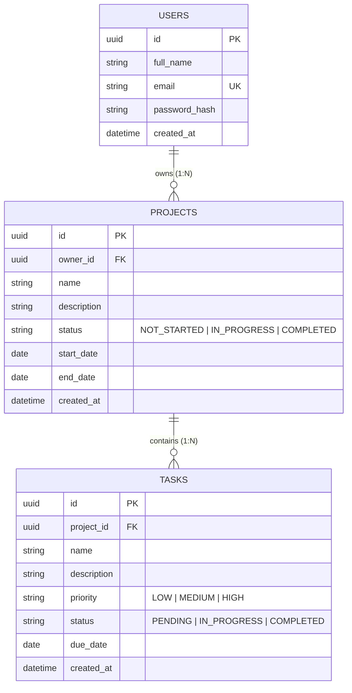

# 📐 Database Schema & ER Diagram

## Relational Entity-Relationship Diagram

---

## Data Tables Specifications

### 1. `users` Table
Stores registered user accounts and credentials.

| Column | Type | Constraints | Description |
|---|---|---|---|
| `id` | UUID | PRIMARY KEY, default `gen_random_uuid()` | Unique user identifier |
| `full_name` | VARCHAR(255) | NOT NULL | User's full name |
| `email` | VARCHAR(255) | NOT NULL, UNIQUE, INDEX | User login email address |
| `password_hash` | VARCHAR(255) | NOT NULL | Bcrypt hashed password |
| `created_at` | TIMESTAMP | DEFAULT `now()` | Registration timestamp |

### 2. `projects` Table
Stores project workspaces owned by users.

| Column | Type | Constraints | Description |
|---|---|---|---|
| `id` | UUID | PRIMARY KEY, default `gen_random_uuid()` | Unique project identifier |
| `owner_id` | UUID | FOREIGN KEY → `users(id)` ON DELETE CASCADE | Owner user ID |
| `name` | VARCHAR(255) | NOT NULL, INDEX | Project title |
| `description` | TEXT | NULLABLE | Detailed project summary |
| `status` | VARCHAR(50) | NOT NULL, DEFAULT `'NOT_STARTED'` | Status (`NOT_STARTED`, `IN_PROGRESS`, `COMPLETED`) |
| `start_date` | DATE | NULLABLE | Target start date |
| `end_date` | DATE | NULLABLE | Target completion date |
| `created_at` | TIMESTAMP | DEFAULT `now()` | Creation timestamp |

### 3. `tasks` Table
Stores tasks belonging to specific projects.

| Column | Type | Constraints | Description |
|---|---|---|---|
| `id` | UUID | PRIMARY KEY, default `gen_random_uuid()` | Unique task identifier |
| `project_id` | UUID | FOREIGN KEY → `projects(id)` ON DELETE CASCADE | Parent project ID |
| `name` | VARCHAR(255) | NOT NULL, INDEX | Task title |
| `description` | TEXT | NULLABLE | Detailed task instructions |
| `priority` | VARCHAR(50) | NOT NULL, DEFAULT `'MEDIUM'` | Priority (`LOW`, `MEDIUM`, `HIGH`) |
| `status` | VARCHAR(50) | NOT NULL, DEFAULT `'PENDING'` | Execution status (`PENDING`, `IN_PROGRESS`, `COMPLETED`) |
| `due_date` | DATE | NULLABLE | Optional deadline |
| `created_at` | TIMESTAMP | DEFAULT `now()` | Task creation timestamp |
